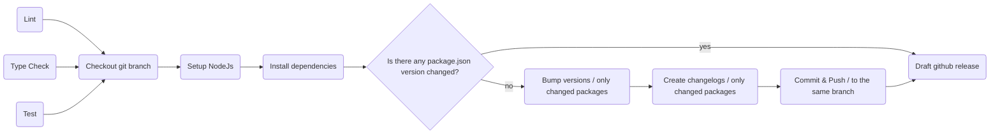

# [WIP !!!] Monorepo release test

## Prepare Release

If you create a PR from the branch called `release/*` with `main` branch as a target it will automatically trigger [prepare-release workflow](.github/workflows/prepare-release.yml).



## Pre-Release

???

## Canary Release

????

## How it's built

Once you merge anything into the `main` branch or directly push into it, [the "publish" workflow](/.github/workflows/publish.yml) should trigger ["test" workflow](/.github/workflows/publish.yml) and if it is finished successfully, build and publish appropriate packages.

## Auxillary commands

Get the visualization of the graph. You can interactively explore what your workspace looks like and the relationships between the packages.

```sh
npx nx graph
```

[Read more here](https://nx.dev/core-features/explore-graph)
