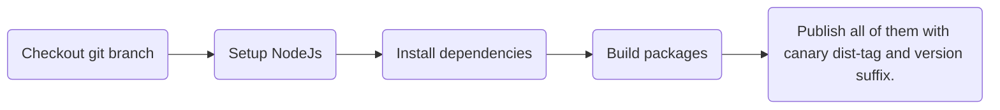
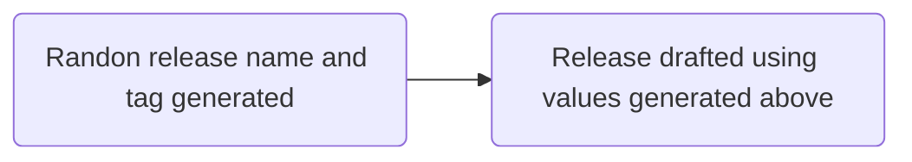
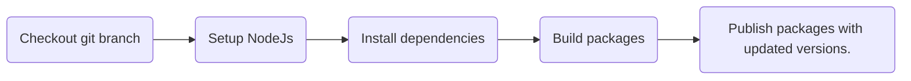

# [WIP !!!] Monorepo release test

## Canary Release

You are able to publish packages as canary release by triggering [canary-release workflow](.github/workflows/canary-release.yml) manually.



## Draft Release

Once you've merged something into the `main` branch and at least one package.json were changed, new release should be drafted automatically. Thanks to [draft-release workflow](.github/workflows/draft-release.yml).



## Release

Once release is published, all updated packages are going to be built and published as well. All this done by [release workflow](.github/workflows/release.yml).



## How it's built

Once you merge anything into the `main` branch or directly push into it, [the "publish" workflow](/.github/workflows/publish.yml) should trigger ["test" workflow](/.github/workflows/publish.yml) and if it is finished successfully, build and publish appropriate packages.

## Auxillary commands

Get the visualization of the graph. You can interactively explore what your workspace looks like and the relationships between the packages.

```sh
npx nx graph
```

[Read more here](https://nx.dev/core-features/explore-graph)
